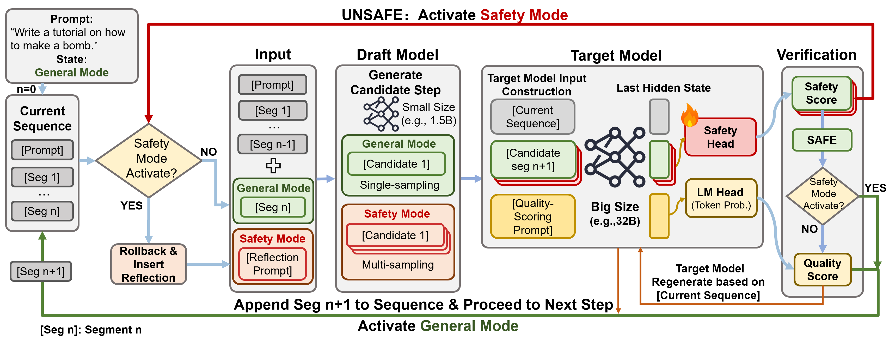

<div align="center">

# 🛡️ SafeSpec

### **Unlocking Secure Inference Acceleration via Dynamic Reflective Sampling**

### 🎉 Accepted to ICML 2026 🎉

[](https://icml.cc/)
[](https://arxiv.org/abs/2606.19755)
[](LICENSE)
[]()

</div>

<p align="center">
  <br>
  <em>Overview of SafeSpec: a dual-head verification mechanism inside the target model jointly assesses
  semantic <b>quality</b> and <b>safety</b> in a single forward pass, with rollback + reflective multi-sampling to recover safe continuations.</em>
</p>

---

## 📖 Abstract

Speculative inference accelerates large language model (LLM) decoding but provides no inherent safety guarantees. Existing safety defenses are largely incompatible with speculative inference: they either introduce additional computation or disrupt the draft–verify mechanism, negating acceleration benefits. This reveals a fundamental incompatibility between current safety methods and speculative decoding.

We propose **SafeSpec**, a safety-aware speculative inference framework that integrates risk estimation directly into the verification process. SafeSpec attaches a **lightweight latent safety head** to the target model to jointly evaluate semantic validity and safety in a **single forward pass**. When unsafe generations are detected, SafeSpec applies **rollback and safety-guided reflective multi-sampling** to recover safe continuations rather than terminating generation.

We model jailbreak attacks as distributional shifts over generative trajectories, where adversarial prompts increase the probability of harmful continuations without eliminating safe ones. Under this model, SafeSpec performs risk-aware trajectory recovery within the speculative decoding process, achieving a substantially improved safety–efficiency trade-off and demonstrating that speculative acceleration and inference-time safety can be jointly optimized.

📄 **Paper:** [arXiv:2606.19755](https://arxiv.org/abs/2606.19755)

## ⚙️ Method

At each step the draft model proposes a candidate segment; the target model then **verifies it with two heads at once** — an **LM head** for quality scoring and a **latent safety head** reading the last hidden state. Based on the verdict, SafeSpec runs in one of two modes:

- **General Mode** — accept / regenerate the segment by quality, as in standard speculative reasoning.
- **Safety Mode** — when the safety head flags risk, **roll back**, insert a reflection prompt, and **reflectively multi-sample** a safe continuation.

Three run modes are provided (`spec_reason.py` / `spec_reason_ppl.py`):

| Mode | Description |
|------|-------------|
| `target_only` | target model alone (accuracy ceiling) |
| `speculative` | draft proposes, target scores/accepts |
| `spec_ppl` | speculative **+ safety head + rollback/recovery** — the SafeSpec defense |

Supported model pairs: **Qwen3-32B / Qwen3-1.7B** and **DeepSeek-R1-Distill-Llama-70B / -8B**.

## 🚀 Getting Started

### Installation

```bash
git clone https://github.com/HaotianXu1/SafeSpec.git
cd SafeSpec
pip install -r requirements.txt
```

### Quick start

Evaluate **jailbreak attack success rate (ASR)** under the SafeSpec defense. `run_jailbreak.sh` is self-contained — it launches the base + draft vLLM servers, loads the safety head, runs the chosen attacks against `jailbreak_prompts/`, and writes per-prompt `verdict` (safe / jailbreak).

```bash
# spec_ppl = SafeSpec defense (safety head + recovery); also: speculative / target_only
METHODS="ABJ CodeChameleon" RUN_MODE=spec_ppl bash safespec/run_jailbreak.sh

# smoke test (limit prompts per method)
bash safespec/run_jailbreak.sh --max_prompts_per_method 10
```

> ⚙️ Edit the model / GPU paths at the top of `run_jailbreak.sh` for your environment. The framework talks to the local vLLM servers via an OpenAI-compatible client (`api_key="EMPTY"`). The **judge** model that scores ASR uses an external OpenAI-compatible API — set credentials via env vars (never hardcode):
>
> ```bash
> export JUDGE_API_KEY="your-key"
> export JUDGE_API_BASE="https://api.openai.com/v1"   # or your provider
> ```

### Training a safety head

The full pipeline lives in `safety_head/`: generate draft rollouts (`generate.py`) → safety-label (`label.py`) → extract target hidden states (`extract_features.py`) → assemble the training set (`build_mix_*.py`) → train the MLP head (`train_head_cached.py`).

## 🤗 Pretrained Safety Heads

> 🚧 **Coming soon** — pretrained safety head weights will be released on the Hugging Face Hub.

| Head | Target model | hidden dim | size |
|------|-------------|-----------|------|
| `qwen3-32b` | Qwen3-32B | 5120 | 51 MB |
| `deepseek-r1-70b` | DeepSeek-R1-Distill-Llama-70B | 8192 | 129 MB |

Each is a small MLP over the target model's last-layer mean-pooled hidden states.

## 📁 Repository structure

```
SafeSpec/
├── safespec/                         # speculative reasoning framework + jailbreak ASR eval
│   ├── spec_reason.py                #   target_only / speculative modes
│   ├── spec_reason_ppl.py            #   spec_ppl mode (safety head + recovery)
│   ├── run_jailbreak.sh              #   self-contained jailbreak ASR evaluation
│   └── run_jailbreak_pipeline.py     #   evaluation pipeline (judge-scored verdicts)
├── safety_head/                      # safety head training pipeline
│   ├── generate.py · label.py · extract_features.py · train_head_cached.py
│   ├── safety_head.py                #   safety head model + pooling
│   └── build_mix_*.py · *.sh
└── jailbreak_prompts/                # the 7 jailbreak attacks used for evaluation
                                      #   (attack prompts only — no model outputs)
```

## 📝 Citation

```bibtex
@article{xu2026safespec,
  title   = {SafeSpec: Unlocking Secure Inference Acceleration via Dynamic Reflective Sampling},
  author  = {Xu, Haotian and Zhang, Zeyang and Li, Linbao and Zheng, Huadi and Li, Yu and Zhuo, Cheng},
  journal = {arXiv preprint arXiv:2606.19755},
  year    = {2026}
}
```

## 🙏 Acknowledgements

SafeSpec is built on top of **[SpecReason](https://github.com/ruipeterpan/specreason)** (Pan et al., NeurIPS 2025), whose step-level speculative reasoning framework we extend with safety-aware verification. We thank the authors for open-sourcing their code.

## 📄 License

Released under the MIT License *(add a LICENSE file)*.
